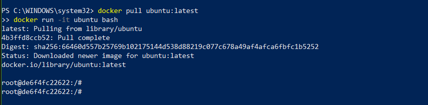
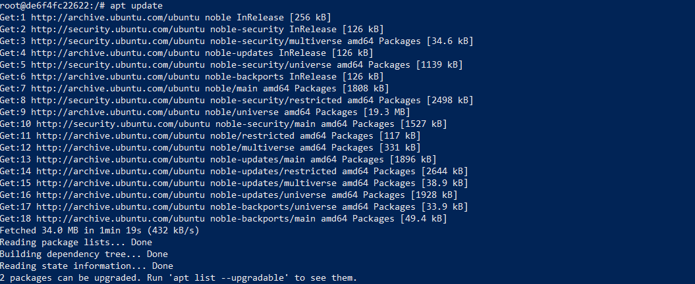
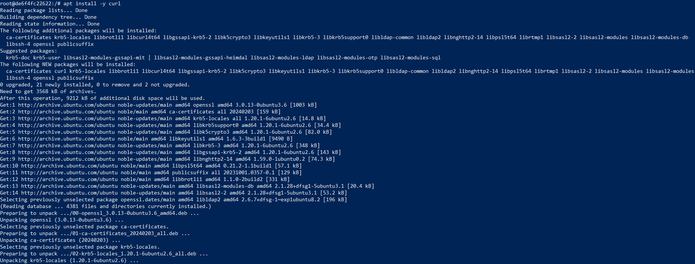
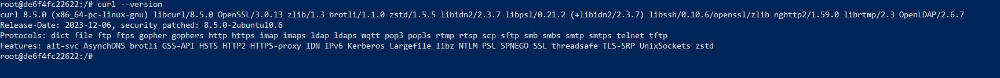
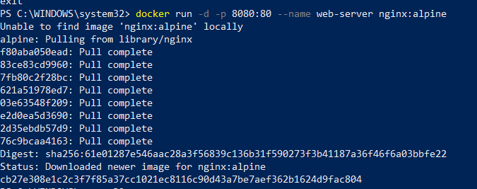
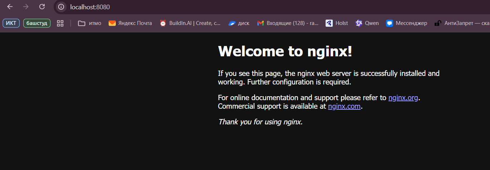

# ITMO University  

**Faculty:** FTMI  
**Course:** Introduction in Web Technologies  
**Academic Year:** 2025 / 2026  

---

## Лабораторная работа №1  

**Group:** U4225  
**Author:** Ziyazetdinov Ramiz Rustemovich  
**Date of creation:** 14.10.2025


---

## Ход работы
### Шаг 1. Запуск базовых контейнеров 

- `docker run hello-world` — проверка работоспособности Docker;  
- `docker pull ubuntu:latest` и запуск `docker run -it ubuntu bash`, установка `curl`, `vim` в контейнере;


### Шаг 2. Работа с готовыми образами (Ubuntu)

- Скачал и запустил образ:
  ```bash
  docker pull ubuntu:latest
  docker run -it ubuntu bash
  apt update && apt install -y curl
  curl --version
  ```
  
  



### Шаг 3. Запуск веб-сервера Nginx
- Запуск контейнера с образом nginx:  
  ```bash
  docker run -d -p 8080:80 --name web-server nginx:alpine
  docker logs web-server
  ```




  


