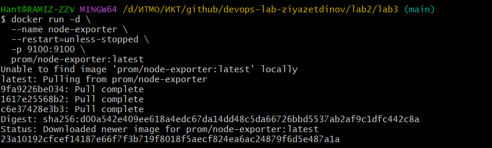
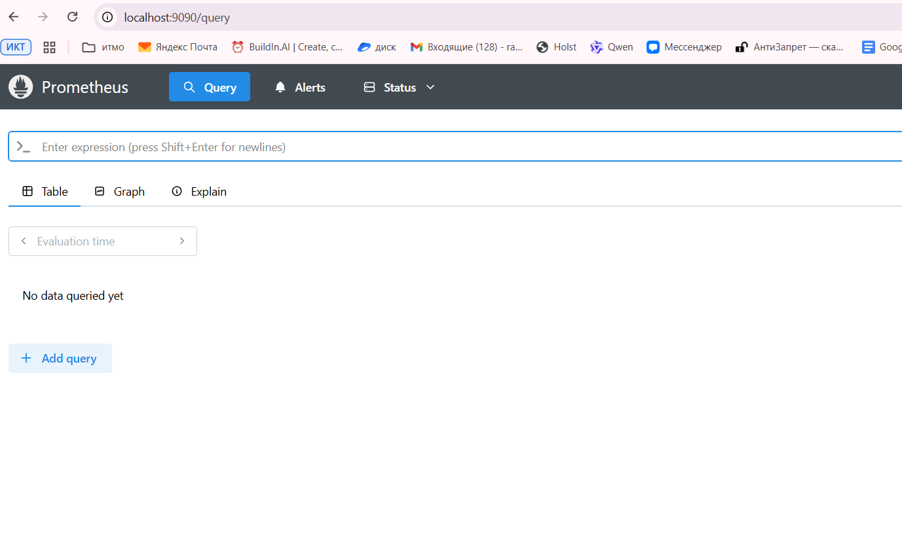
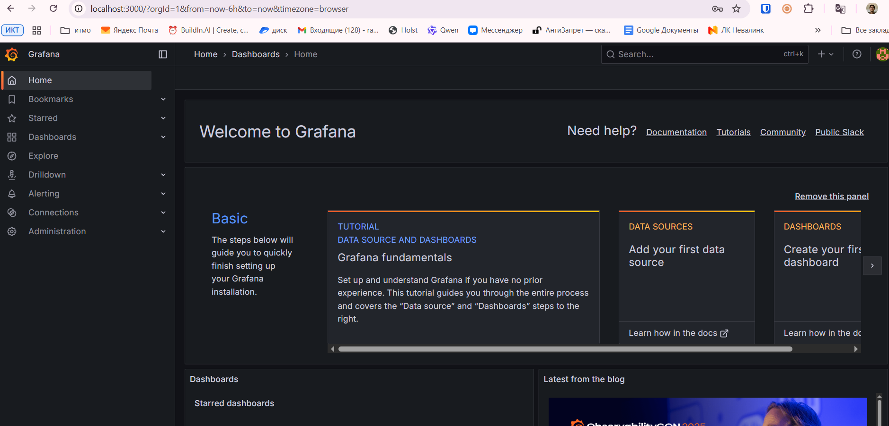
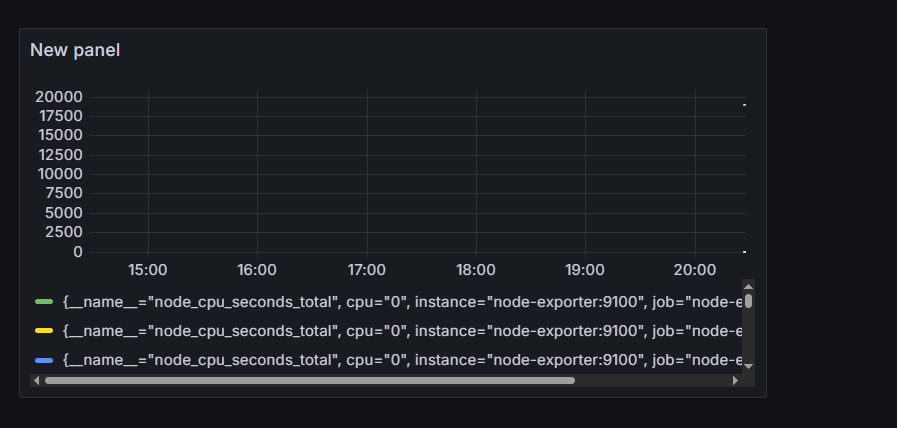
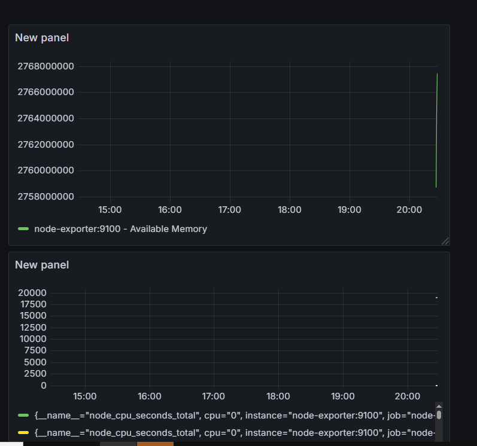
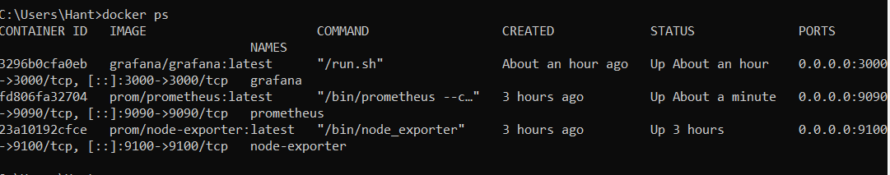
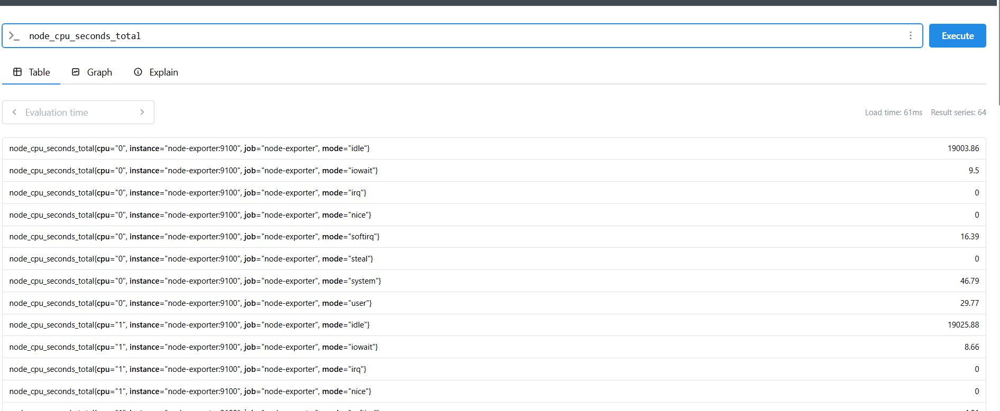

# ITMO University  

**Faculty:** FTMI  
**Course:** Introduction in Web Technologies  
**Academic Year:** 2025 / 2026  

---

## Лабораторная работа №3 

**Group:** U4225  
**Author:** Ziyazetdinov Ramiz Rustemovich  
**Date of creation:** 16.10.2025

# Лабораторная работа #3: Система мониторинга на базе Prometheus и Grafana

## Цель работы
Научиться настраивать локальную систему мониторинга, собирать метрики с помощью Prometheus и создавать дашборды в Grafana для визуализации данных.

## Ход работы

### 1. Создание конфигурации Prometheus

- Создал папку `prometheus` для конфигурации:
- Создал файл prometheus/prometheus.yml

## 2. Запуск Node Exporter
- Запустил контейнер Node Exporter для сбора системных метрик:
СКРИН
- Проверил работу Node Exporter:
  

## 3. Запуск Prometheus
- Создал том для данных Prometheus
- Запустил контейнер Prometheus:

 
 

## 4. Запуск Grafana
- Создал том для данных Grafana:
- Проверил работу Grafana: открыл http://localhost:3000 в браузере (логин: admin, пароль: admin)
- Добавил источник данных Prometheus
- Создал дашборд

 
 
 

## 5. Тестирование системы
Проверил все контейнеры:

 
 

